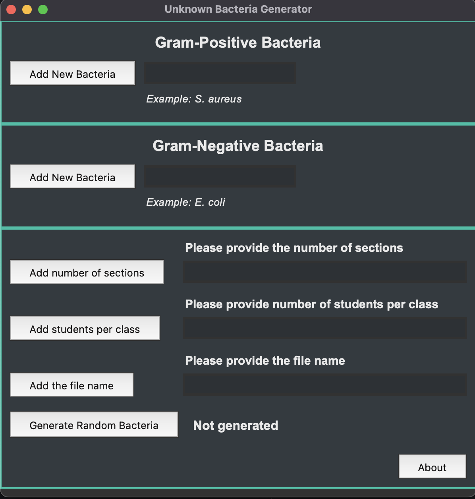

# unknown-gen
Generate excel of unknown bacteria for labs.

This is a small GUI app built with tkinter for creating an excel file populated
with randomized bacteria. The idea for this project came about during my time as a
TA for a microbiology course at UNH. As a part of the lab, we have our students
attempt to identify an unknown bacteria using a series of biochemical tests.

As you can imagine the setup for this lab can take some time, and I had the idea
of creating this small app to streamline a part of the process.

# Demo
---

The app is quite simple as it includes a couple fields for data input.
The most obvious being the fields for adding Gram positive and negative bacteria

